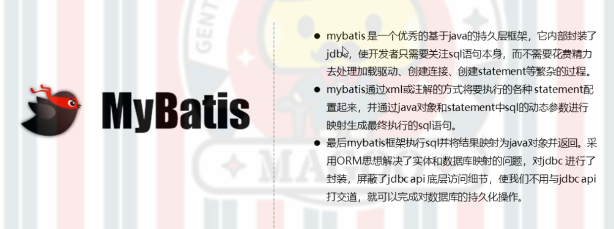

# Mybatis简介
## 原始jdbc操作的分析

## 什么是Mybatis

## Mybatis开发步骤

UserMapper.xml
```xml

<?xml version="1.0" encoding="UTF-8" ?>
<!DOCTYPE mapper
        PUBLIC "-//mybatis.org//DTD Mapper 3.0//EN"
        "http://mybatis.org/dtd/mybatis-3-mapper.dtd">
<mapper namespace="userMapper">
    <select id="findAll" resultType="com.ang.domain.UserBean">
        select * from user;
    </select>
</mapper>


```
sqlMapConfig.xml
```xml
<?xml version="1.0" encoding="UTF-8" ?>
<!DOCTYPE configuration
        PUBLIC "-//mybatis.org//DTD Config 3.0//EN"
        "http://mybatis.org/dtd/mybatis-3-config.dtd">
<configuration>
    <environments default="development">
        <environment id="development">
            <transactionManager type="JDBC"/>
            <dataSource type="POOLED">
                <property name="driver" value="com.mysql.jdbc.Driver"/>
                <property name="url" value="jdbc:mysql://localhost:3306/temp"/>
                <property name="username" value="root"/>
                <property name="password" value="angelong"/>
            </dataSource>
        </environment>
    </environments>
    <mappers>
        <mapper resource="com/ang/UserMapper.xml"/>
    </mappers>
</configuration>
```
MybatisTest.java
```java
    @Test
    public void demo1() throws IOException {
        InputStream resourceAsStream = Resources.getResourceAsStream("sqlMapConfig.xml");
        SqlSessionFactory build = new SqlSessionFactoryBuilder().build(resourceAsStream);
        SqlSession sqlSession = build.openSession();
        List<UserBean> objects = sqlSession.selectList("userMapper.findAll");
        System.out.println(objects);
        sqlSession.close();
    }
}
```
## Mybatis的映射文件概述

## Mybatis的增删改查操作
### 插入数据操作注意问题

# Mybatis核心配置文件概述
## 核心配置文件层级关系

## 常用配置解析
### environments标签


### mappers标签

### Properties标签

### typeAliases标签

### 知识小结
* 核心配置文件常用配置：

# Mybatis相应API

## SqlSession工厂构建器SqlSessionFactoryBuilder

## SqlSession工厂对象SqlSessionFactory

## SqlSession会话对象


# Mybatis的Dao层实现
## 代理开发方式


## 知识小结


# Mybatis映射文件深入
## 动态sql语句


## SQL片段抽取


# Mybatis核心配置文件深入
## plugins标签


# Mybatis的多表操作
## 多表查询
### 一对一查询的模型

User.java
```java
private int id;
private String username;
private String password;
geter and seter ...
toString ...
```
Order.java
```java
private int uid;
private double total;
private User user;
geter and seter ...
toSteing ...
```
UserMapper.xml
```xml

    <resultMap id="orders" type="com.ang.domain.Orders">
        <id column="uid" property="uid"/>
        <result column="total" property="total"/>
        <association property="user" javaType="user">
            <id column="id" property="id"/>
            <result column="username" property="username"/>
            <result column="password" property="password"/>
        </association>
        <!--<result column="id" property="user.id"/>
        <result column="username" property="user.username"/>
        <result column="password" property="user.password"/>-->
    </resultMap>
    
    <select id="findUserAndOrders" resultMap="orders">
        select * from user u,orders o where u.id=o.uid;
    </select>

```
## 一对多查询

User.java
```java
private int id;
private String username;
private String password;

private List<Orders> ordersList;
geter and seter ...
toString ...
```
Orders.java
```java
private int uid;
private double total;
private int oid;

private User user;

geter and seter ...
toString ...
```
UserMapper.xml
```xml
    <resultMap id="orderList" type="com.ang.domain.User">
        <id column="id" property="id"/>
        <result column="username" property="username"/>
        <result column="password" property="password"/>
        <collection property="ordersList" ofType="orders">
            <result column="uid" property="uid"/>
            <result column="total" property="total"/>
            <result column="oid" property="oid"/>
        </collection>
    </resultMap>

    <select id="findOrderList" resultMap="orderList">
        select * from user u,orders o where u.id=o.oid;
    </select>
```
## 多对多查询

User.java
```java
private int id;
private String username;
private String password;

private List<Role> roleList;

geter and seter ...
toString ...
```
Role.java
```java
private int id;
private String roleName;

private List<User> userList;

geter and seter ...
toString ...
```
UserMapper.xml
```xml
    <resultMap id="userList" type="com.ang.domain.User">
        <id column="id" property="id"/>
        <result property="username" column="username"/>
        <result column="password" property="password"/>
<!--        role是MapperConfig.xml中抽取出来的Role类-->
        <collection property="roleList" ofType="role">
<!--            roleid是中间表的字段名称-->
            <result column="roleid" property="id"/>
            <result property="roleName" column="roleName"/>
        </collection>
    </resultMap>

    <select id="findUserAndRoleAll" resultMap="userList">
        select * from user u,user_role ur,role r where u.id=ur.userid and r.id=ur.roleid;
    </select>

```
# Mybatis的注解开发
## 常用注解


## 代码实现
### 核心配置文件
MapperConfig.xml
```xml
<?xml version="1.0" encoding="UTF-8" ?>
<!DOCTYPE configuration
        PUBLIC "-//mybatis.org//DTD Config 3.0//EN"
        "http://mybatis.org/dtd/mybatis-3-config.dtd">
<configuration>
    <properties resource="jdbc.properties"/>

   <!-- <typeAliases>
        <typeAlias type="com.ang.domain.Orders" alias="orders"/>
    </typeAliases>-->

    <environments default="top">
        <environment id="top">
            <transactionManager type="JDBC"/>
            <dataSource type="POOLED">
                <property name="driver" value="${driver}"/>
                <property name="url" value="${url}"/>
                <property name="username" value="${username}"/>
                <property name="password" value="${password}"/>
            </dataSource>
        </environment>
    </environments>
    <mappers>
<!--        <package name="com.ang.dao.UserMapper"/>-->
<!-- 重点注意此处是映射接口的包路径 -->
        <package name="com.ang.dao"/>
    </mappers>
</configuration>
```
### 实体类
User.java
```java
private int id;
private String username;
private String password;

geter and seter ...
toString ...
```
Orders.java
```java
private int uid;
private double total;
private int oid;

geter and seter ...
toString ...
```
### 映射接口
```java
public interface UserMapper {

    @Select("select * from user")
    List<User> findAll() throws IOException;

    @Select("select * from user u,orders o where u.id=o.uid")
    @Results(
             {@Result(column = "id",property = "id"),
                    @Result(column = "username", property = "username"),
                    @Result(column = "password",property = "password"),
                     @Result(
                             property = "orders",//要封装的属性名称（Orders实体类的名称）
                             column = "id",//根据那个字段去查询order表的数据
                             javaType = Orders.class,//要封装的实体类的类型
                             one = @One(select = "com.ang.dao.UserMapper.findById")//select属性：代表查询那个接口的方法获得数据
                     )
                    /*@Result(column = "uid",property = "orders.uid"),
                    @Result(column = "total",property = "orders.total"),
                    @Result(column = "oid",property = "orders.oid")*/
            }
    )
    List<User> findUserOrders();

    @Select("select * from orders where uid=#{id}")
    List<Orders> findById(int id);
}

```


## 一对多
### 实体类
User.java
```java
private int id;
private String username;
private String password;

private List<Orders> ordersList;

geter and seter ...

toString ...

```
### 映射接口
```java
    @Select("select * from user")
    @Results({
            @Result(column = "id",property = "id"),
            @Result(column = "username",property = "username"),
            @Result(column = "password",property = "password"),
            @Result(
                    property = "ordersList",
                    column = "id",
                    javaType = List.class,
                    many = @Many(select = "com.ang.dao.UserMapper.findByOid")
            )
    })
    List<User> findUserAndOrdersAll();

    @Select("select * from orders where oid=#{id}")
    List<Orders> findByOid(int id);
```
## 多对多查询
User.java
```java
private int id;
private String username;
private String password;

private List<Role> roleList;

geter ang select ...
toString ...
```
Role.java
```java
private int id;
private String roleName;

geter and seter ...
toString ...
```
### 映射接口
UserMapper.xml
```xml
    @Select("select * from role r,user_role u where u.roleid=r.id and u.userid=#{id}")
    List<Role> findRoleById(int id);

    @Select("select * from user")
    @Results({
            @Result(column = "id",property = "id"),
            @Result(column = "username",property = "username"),
            @Result(column = "password",property = "password"),
            @Result(
                    property = "roleList",
                    column = "id",
                    javaType = List.class,
                    many = @Many(select = "com.ang.dao.UserMapper.findRoleById")
            )
    })
    List<User> findUserAndRoleAll();

```
