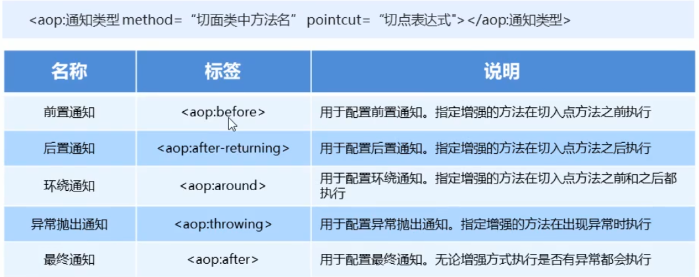
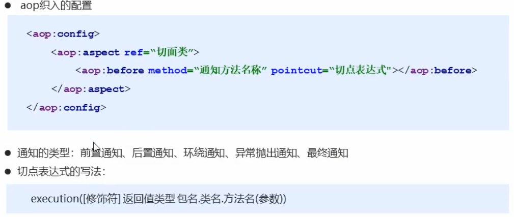
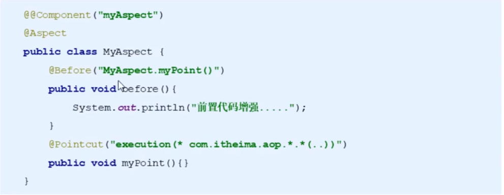
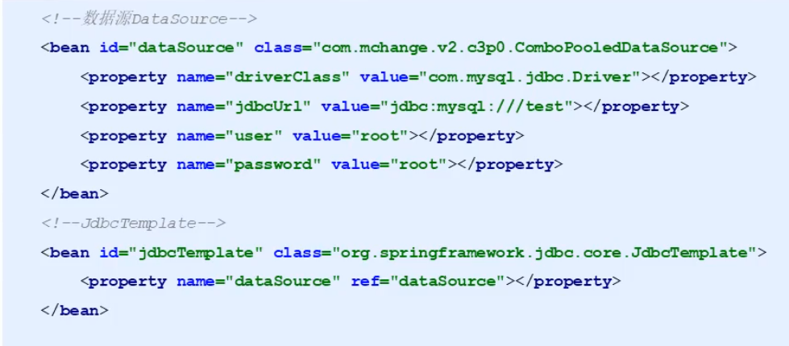
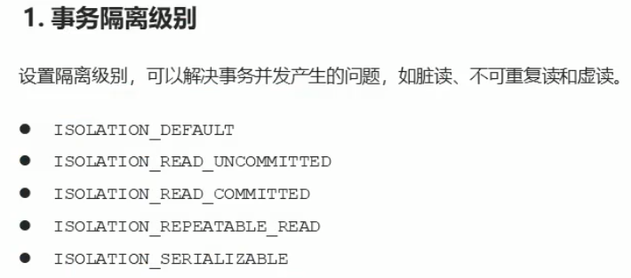
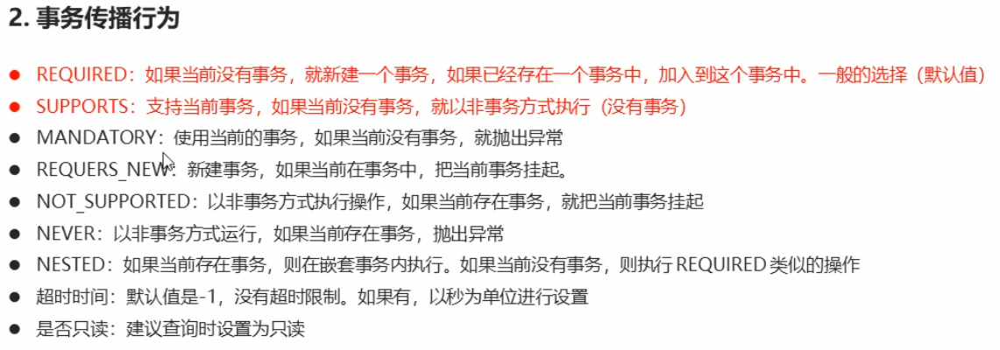
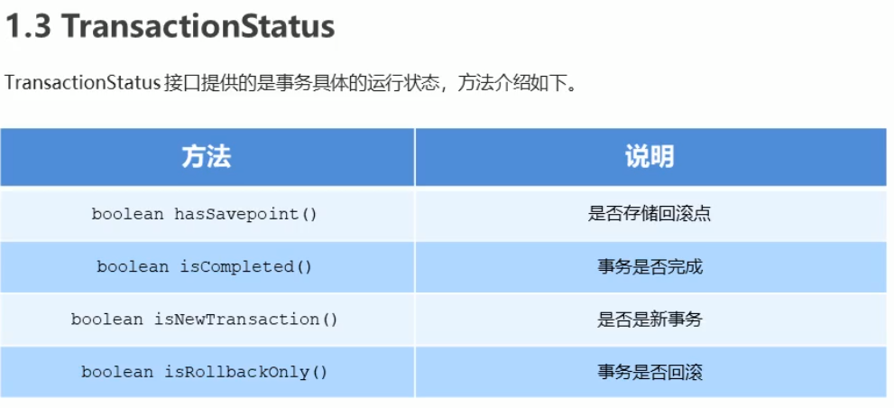
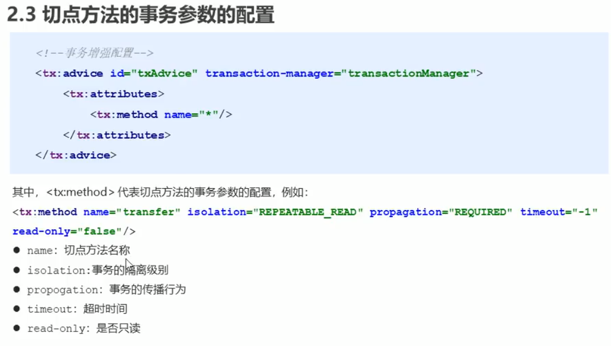

# 数据连接池通过properties文件在aplicationContext.xml中进行注入方法解耦
> 可以在xml文件中通过  ${key} 获取properties中相应键的值

[jdbc.properties]()
```properties
jdbc.driver=com.mysql.jdbc.Driver
jdbc.url=jdbc:mysql://localhost:3306/temp
jdbc.username=root
jdbc.password=angelong
```

[applicationContext.xml]()
```xml
<?xml version="1.0" encoding="UTF-8"?>
<beans xmlns="http://www.springframework.org/schema/beans"
       xmlns:context="http://www.springframework.org/schema/context"
       xmlns:xsi="http://www.w3.org/2001/XMLSchema-instance"
       xsi:schemaLocation="http://www.springframework.org/schema/beans http://www.springframework.org/schema/beans/spring-beans.xsd
                            http://www.springframework.org/schema/context http://www.springframework.org/schema/context/spring-context.xsd">

    <context:property-placeholder location="classpath:jdbc.properties"/>
    
<!--    druid数据连接池-->
    <bean id="dataSource" class="com.alibaba.druid.pool.DruidDataSource">
        <property name="driverClassName" value="${jdbc.driver}"/>
        <property name="url" value="${jdbc.url}"/>
        <property name="username" value="${jdbc.username}"/>
        <property name="password" value="${jdbc.password}"/>
    </bean>
```
# 三层架构详解


# Spring注解


# Spring注解开发注意
## 使用@Autowired和@Qualifier注解标注(可以替换为@Resource)
* 在Xml文件中配置时方法必须要使用set方法进行注入
```java
private UserDao userDao;
public void setUserDao(UserDao userDao){
    this.userDao = userDao;
}
```
* 在使用注解开发时可以不写set方法
```java
@Autowired
@Qualifier("userDao")
private UserDao userDao;
```
## @Autowired默认自动注入使用类型注入
> 当只使用@Autowired注解时，会按照数据类型从Spring容器中进行匹配（匹配必须唯一，否则会报错）

# Spring新注解


[配置类 Config]()
```java
//标注当前类是配置类
@Configuration
//自动扫描包
@ComponentScan("ang.com")
//java载properties文件
@PropertySource("classpath:jdbc.properties")
public class Config {

//普通方法注入
    @Value("${jdbc.driver}")
    private String driver;
    @Value("${jdbc.url}")
    private String url;
    @Value("${jdbc.username}")
    private String username;
    @Value("${jdbc.password}")
    private String password;

//将该方法的返回值存储到spring容器中
    @Bean("dataSource")
    public DataSource dataSource(){
        DruidDataSource dataSources = new DruidDataSource();
        dataSources.setDriverClassName(driver);
        dataSources.setUrl(url);
        dataSources.setUsername(username);
        dataSources.setPassword(password);
        return dataSources;
    }
}
```

[测试 test]()
```java
    @Test
    public void data(){
        ApplicationContext applicationContext = new AnnotationConfigApplicationContext(Config.class);
        DataSource dataSource = (DataSource) applicationContext.getBean("dataSource");
        System.out.println(dataSource);
    } 
```


# Spring集成Junit步骤
1. 导入Spring集成坐标Junit
2. 使用@Runwith注解替换原来的运行期
3. 使用@ContextConfiguration指定配置文件或配置类
4. 使用@Autowired注入需需要测试的对象
5. 创建测试方法进行测试

[导入spring-test坐标]()
```xml
<dependency>
    <groupId>orgspringframework<groupId>
    <artifactId>spring-test</artifactId>
    <version>5.0.5.RELEASE</version>
</dependency>
```
[测试类test]()
```java
@RunWith(SpringJUnit4ClassRunner.class)
//xml配置
@ContextConfiguration("classpath:applicationContext.xml")
//注解配置
@ContextConfiguration(classes = Config.class)
public class JunitTest {

    @Autowired
    private UserServiceImpl userService;

    @Test
    public void tst(){
        userService.save();
    }
```
# Spring的AOP知识要点
* aop：面向切面编程
* aop底层实现：基于JDK的动态代理和基于Cglibd的动态代理
* aop的重点概念：
  * Pointcut（切入点）：被增强的方法
  * Advice（通知/增强）：封装增强业务逻辑的方法
  * Aspect（切面）：切点+通知
  * Weaving（织入）：将切点与通知结合的过程
* 开发明确事项：
  * 谁是切点（切点表达式配置）
  * 谁是通知（切面类中的增强方法）
  * 将切点和通知进行织入配置

## 通知的类型


## 知识要点


# 注解的aop开发
## 开发步骤
> 1. 创建目标接口和目标类（内部有切点）
> 2. 创建切面类（内部有增强方法）
> 3. 将目标类和切面类的对象创建权交给spring
> 4. 在切面类中使用注解配置织入关系
> 5. 在配置文件中开启组件扫描和AOP的自动代理
> 6. 测试

## aop注解通知类型


## aop切点表达式的抽取
> 同xml配置aop一样，我们可以将切点表达式抽取，抽取方式是在切面内定义方法，在该方法上使用@Pointcut注解定义切点表达式，然后再在增强注解中进行引用。具体如下


```java
@Component("aopAnnoAdvice")
@Aspect
public class AopAnnoAdvice {

    @Pointcut("execution(* ang.com.aopService.AopAnnoI.*(..))")
    public void pointcut(){}

    @Before("AopAnnoAdvice.pointcut()")
    public void before(){
        System.out.println("Anno执行 前置通知>>>>>>>>>");
    }
}
```
# Spring JdbcTemplate
## 开发步骤
> 1. 导入spring-jdbc和spring-tx坐标
> 2. 创建数据库表和实体类
> 3. 创建JdbcTemplate对象
> 4. 执行数据库操作

## Spring产生JdbcTemplate对象
> 我们可以将JdbcTemplate的创建权交给Spring，将数据源DataSource的创建权也交给Spring，在Spring容器内部将数据源DataSource注入到JdbcTemplate模板对象中



## 知识要点
> 1. 导入Spring-jdbc和spring-tx坐标
> 2. 创建数据库和实体类
> 3. 创建JdbcTemplate对象
>		```java
		JdbcTemplate jdbcTemplate = new JdbcTemplate();
		jdbcTemplate.setDataSource(dataSource);
>		```
> 4. 执行数据库操作
>		更新操作：
>		```java
		jdbcTemplate.update(sql,params)
>		```
>		查询操作：
>		```java
		jdbcTemplate.query(sql,Mapper,params)
		jdbcTemplate.queryForObject(sql,Mapper,params)
>		```


# 事务控制
## 事物控制相关对象


## 事物的隔离级别


## 事物的传播行为


## 事物状态对象


## 切点方法的事物参数的配置



